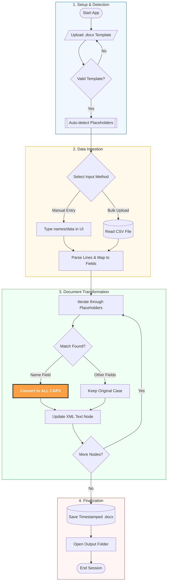

# 🏗️ TESDA ID Generator - System Architecture & Logic

This document provides a comprehensive overview of how the ID Generator operates, from user interaction to the internal document transformation logic.

---

## 🗺️ High-Level Application Flow

The following diagram breaks down the lifecycle of an ID generation session into four distinct phases: **Setup**, **Ingestion**, **Transformation**, and **Output**.

---

## 📖 Detailed Logic Explanation

### 1. Setup & Detection
*   **Template Analysis**: The app doesn't just "write" over a file; it parses the internal XML structure of the `.docx`.
*   **Auto-Detection**: It specifically looks for defined keys like `NAME HERE` or `CODE HERE`. If your template has two IDs per page, it intelligently identifies duplicate placeholders to ensure both are updated for the same person.

### 2. Data Ingestion
*   **Flexible Mapping**: The system supports multiple CSV formats (1, 4, 8, or 9 columns). 
*   **Smart Parsing**: Whether you paste data with tabs, commas, or multiple spaces, the backend normalizes the input to prevent "empty" data from being generated.

### 3. Transformation (The "Brain")
*   **Case Normalization**: To ensure professional standards, the **Name** field is programmatically intercepted. Even if a user types `john doe`, the system applies `.upper()` during the XML injection phase to produce `JOHN DOE`.
*   **XML Injection**: The app reaches into the document's `word/document.xml` and replaces the text within `<w:t>` tags without breaking the surrounding formatting (font, size, color).

### 4. Finalization
*   **Non-Destructive Saving**: To protect your original template, the system generates a unique filename using the pattern: `UPDATED_IDS_YYYYMMDD_HHMMSS.docx`.

---

## 🎨 Team Design Standards (Legend)

Use these shapes and colors when expanding this documentation:

| Shape | Role | Mermaid Code |
| :--- | :--- | :--- |
| **Rounded Oval** | Start/End Points | `([Text])` |
| **Rectangle** | Standard Action | `[Text]` |
| **Rhombus/Diamond** | Logic Decision | `{Text}` |
| **Parallelogram** | User Input/File Upload | `[/Text/]` |
| **Cylinder** | Database or Saved File | `[(Text)]` |
| **Double-Border** | Complex Sub-Process | `[[Text]]` |

### **Color Coding Scheme**
- 🔵 **Blue**: Setup & UI Initialization
- 🟡 **Yellow**: Data Handling & Parsing
- 🟢 **Green**: Internal Logic & Transformation
- 🔴 **Red**: File Output & System Completion
